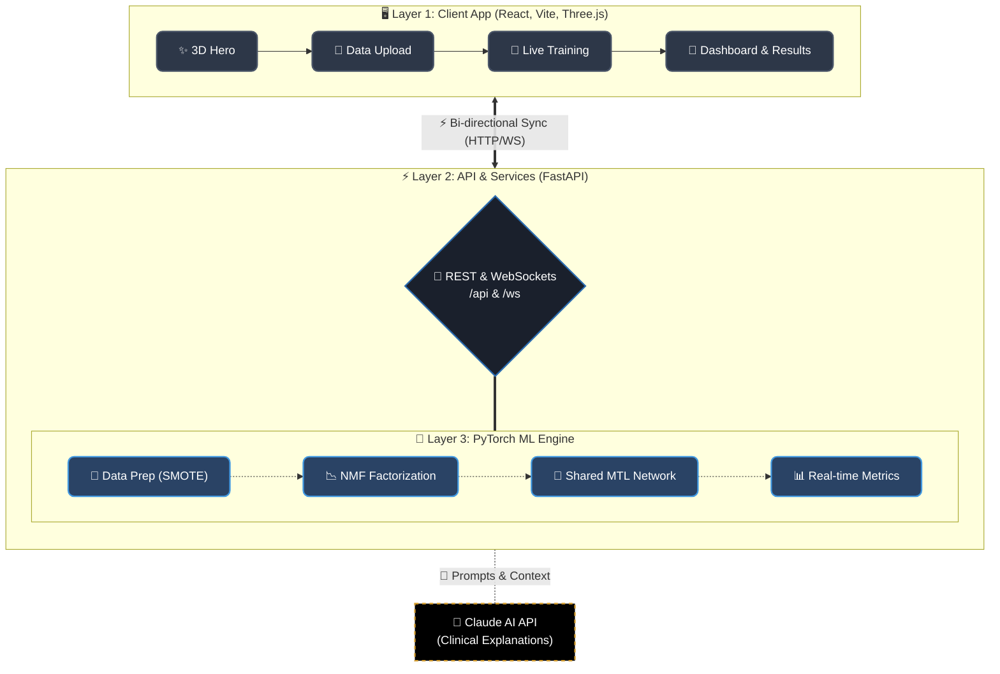

<div align="center">

# 🧬 BioMTL Lab

**Biomedical Multi-Task Learning Platform**

<p>
  A fu neell-stack research-grade web application that simultaneously predicts <b>Heart Attack Risk</b> and <b>Breast Cancer Malignancy</b>.<br/>
  Powered by a <b>Multi-Task Learning (MTL)</b> model and <b>Non-Negative Matrix Factorization (NMF)</b>.
</p>


<p>
  
  
  
  
  
</p>

<h3>
  <a href="https://bio-mtl-lab.vercel.app">
    
  </a>
</h3>

</div>


## 🌟 The Vision

BioMTL Lab addresses a critical challenge in biomedical research: **limited labeled data**. By jointly training on two related clinical datasets through shared latent factors, our MTL model achieves superior accuracy compared to single-task baselines.

<details>
<summary><b>🔬 Uncover How It Works (Click to Expand)</b></summary>
<br/>

1. **NMF Factorization** ⸺ Decomposes both datasets into shared and task-specific latent factors.
2. **Shared Encoder** ⸺ A neural network learns common patterns across heart disease and breast cancer.
3. **Task-Specific Heads** ⸺ Separate output layers specialize in each prediction task.
4. **Knowledge Transfer** ⸺ Shared factors enable cross-task learning, boosting accuracy on small datasets.

</details>

<br/>

## 📊 Datasets at a Glance

| 🧬 Dataset | 📄 Records | 📐 Features | 🎯 Target |
|:---|:---:|:---:|:---|
| **Heart Disease** *(Cleveland-like)* | `302` | `13` clinical features | Heart attack risk (binary) |
| **Breast Cancer** *(Wisconsin-like)* | `569` | `30` cell nucleus measurements | Malignancy (binary) |

---

## 🏗️ System Architecture

Our platform leverages a robust synergy between an interactive frontend and a powerful ML backend.



---

## ✨ Features That Stand Out

- 🎯 **Multi-Task Learning** — Joint heart + cancer prediction via shared NMF factors.
- 📊 **Real-Time Training** — Live loss chart + AUC/F1 metrics streamed via WebSocket.
- 🧬 **3D Visualizations** — Interactive DNA helix (hero) + factor network (results).
- 🤖 **Claude AI Integration** — Clinical explanations + hyperparameter suggestions.
- 📁 **Auto-Detect Upload** — Drop any CSV, system identifies heart vs cancer.
- 🔮 **Single Patient Prediction** — Interactive sliders with animated risk gauge.
- 📈 **Model Comparison** — BioMTL vs Logistic Regression vs Random Forest vs Vanilla MTL.
- 🎨 **Luxury Editorial Design** — Playfair Display, gold/ivory palette, glassmorphism.

---

## 🚀 Getting Started

Follow these steps to launch BioMTL Lab locally.

### 📋 Prerequisites
> **Node.js** v18+ & **npm** v9+  |  **Python** 3.9+  |  **Git**

<details>
<summary><b>🍎 macOS Setup Guide</b></summary>

```bash
# 1. Clone & enter repository
git clone https://github.com/YOUR_USERNAME/bioMTL-lab.git
cd bioMTL-lab

# 2. Backend Setup
python3 -m venv venv
source venv/bin/activate
pip install -r backend/requirements.txt
cd backend && python3 generate_data.py && cd ..

# 3. Frontend Setup
cd frontend && npm install && cd ..

# 4. (Optional) Claude AI Config
echo "ANTHROPIC_API_KEY=sk-ant-your-key-here" > backend/.env

# 5. Run the magic! (In two terminals)
# Terminal 1: Backend
source venv/bin/activate && cd backend && python3 -m uvicorn main:app --reload --port 8000
# Terminal 2: Frontend
cd frontend && npm run dev
```
</details>

<details>
<summary><b>🪟 Windows Setup Guide</b></summary>

```cmd
:: 1. Clone & enter repository
git clone https://github.com/YOUR_USERNAME/bioMTL-lab.git
cd bioMTL-lab

:: 2. Backend Setup
python -m venv venv
venv\Scripts\activate
pip install -r backend\requirements.txt
cd backend && python generate_data.py && cd ..

:: 3. Frontend Setup
cd frontend && npm install && cd ..

:: 4. (Optional) Claude AI Config
echo ANTHROPIC_API_KEY=sk-ant-your-key-here > backend\.env

:: 5. Run the magic! (In two terminals)
:: Terminal 1: Backend
venv\Scripts\activate && cd backend && python -m uvicorn main:app --reload --port 8000
:: Terminal 2: Frontend
cd frontend && npm run dev
```
*(Use `py` instead of `python` if needed).*
</details>

<br/>

### 🌐 Access Points
Once up and running, tap into full power:

- **Frontend App**: [http://localhost:5173](http://localhost:5173) *(Vite Dev Server)*
- **Backend API**: [http://localhost:8000](http://localhost:8000) *(FastAPI Base)*
- **Interactive DOCS**: [http://localhost:8000/docs](http://localhost:8000/docs) *(Swagger UI)*

---

## 📖 Usage Workflow

<div align="center">

| Step | Action | Description |
|:---:|:---:|:---|
| **1** | 📤 **Upload Data** | Drag & drop a CSV file onto drop zones (Heart, Cancer, or Auto-Detect). |
| **2** | 🧠 **Train Model** | Adjust hyperparameters or click "Ask Claude to Suggest". Watch real-time metrics! |
| **3** | 🔮 **Predict** | Slide patient features and see animated risk gauges + AI clinical interpretations. |
| **4** | 📊 **Results** | Compare models (BioMTL vs Baseline), view 3D Latent Factor Network. |

</div>
<br/>

<div align="center">
  <p><b>Created by Vishnu</b> — <i>Academic & Research Minor Project</i></p>
  
</div>
